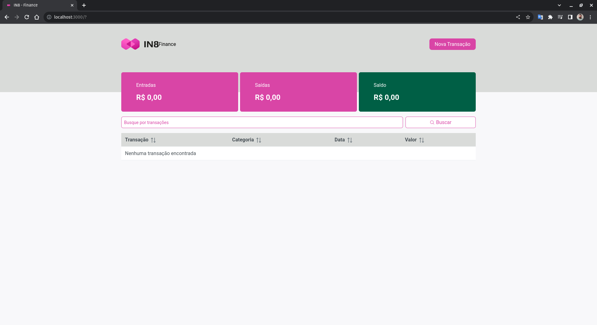
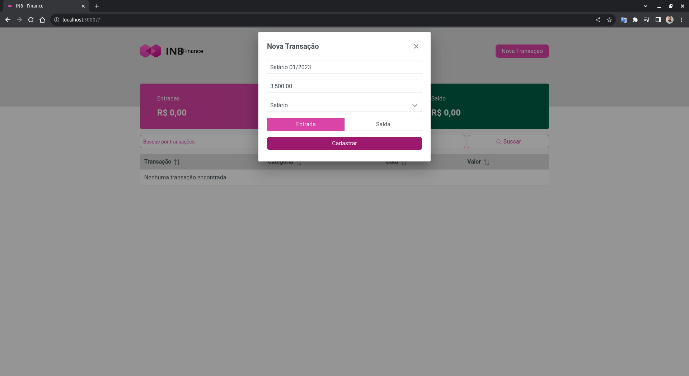

# Aplicativo de Finanças Pessoais - IN8
## Desafio Proposto

**Título do projeto:** Aplicativo de Gerenciamento de Finanças Pessoais.  
 
**Descrição do projeto:** O objetivo deste projeto é desenvolver um aplicativo de gerenciamento de finanças pessoais que ajude os usuários a controlarem suas despesas e receitas. O aplicativo permitirá que os usuários cadastrem suas transações financeiras, categorizem-nas e acompanhem seus gastos ao longo do tempo. Os usuários poderão visualizar gráficos e relatórios sobre seus gastos por categoria, monitorar seus saldos e definir metas financeiras.  

**Obs:** Não é obrigatório implementar os requisitos apresentados acima na totalidade, pode fazer o que for possível, mas seja criativo.  

**Tecnologias sugeridas:**
- Frameworks de frontend  como React/NextJS ou Flutter.  
- Gerenciador de estado.
- Bibliotecas de UI, como Bootstrap ou Material-UI, ou qualquer outro.  
- Armazenamento local, utilizando o localStorage ou qualquer outra alternativa.  

O desafio deve ser enviado [AQUI](https://docs.google.com/forms/d/e/1FAIpQLSdZA8faSnKPGfW8UH-1XNyluV6VPcGTEdnyP4XmqjlSM1J-Gg/viewform)

## Solução  

### Como Rodar a Aplicação:
- Possuir o NodeJS instalado
- Instalar as dependências utilizando `npm install`
- Executar o servidor através do comando `npm run dev:server`
- Executar a aplicação através do comento `npm run dev`
- Acessar a aplicação através do link http://localhost:3000/ 

### Referência de Estilo:  
[Webpage da IN8](https://in8.com.br/)

### Especificações Técnicas:  
- Tecnologias Utilizadas:
    - [ReactJS](https://react.dev/)
    - [NextJS 13](https://nextjs.org/)
    - [Stitches](https://stitches.dev/)
    - [React Hook Form](https://www.react-hook-form.com/)
    - [Zod](https://zod.dev/?id=ecosystem)
    - [PrimeReact](https://www.primefaces.org/primereact-v5/)
    - [Phosphoricons](https://phosphoricons.com/)
    - [JSON-Server](https://www.npmjs.com/package/json-server)
### Requisitos Funcionais:  
- Página Principal:
    - [x] Deve possuir um botão para cadastrar novas transações.
    - [x] Deve possuir um dashboard com 3 categorias: Entradas, Saídas e Saldo.
    - [x] Deve apresentar um input para busca.
    - [x] Deve apresentar uma lista de transações de acordo com o input de busca. Caso o imput esteja vazio, deve apresentar todas as transações.
    - [x] Deve ser possível filtrar os dados de acordo com os cabecalhos da tabela (por ordem crescente ou decrescente).
- Modal de Transações:
    - [x] O sistema deve possuir um modal para adicionar transações.
    - [x] O modal deve permitir que usuários consigam aidicionar novas transações, contendo 'Descrição', 'Valor', 'Categoria' e 'Tipo de Transação'.
    - [x] O modal deve possuir validação dos dados inseridos.
    - [x] O modal deve possuir um botão com a funcionalidade de submeter a transação.

### Evidências:

